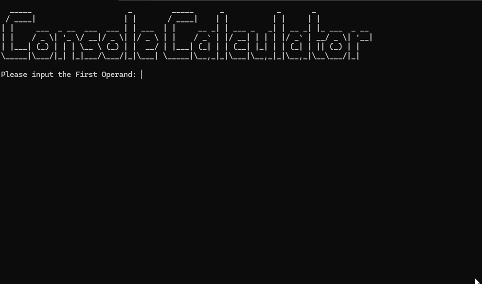

# Console Calculator C / C++

This is a simple console-based calculator program written in C. It supports basic arithmetic operations: addition, subtraction, multiplication, division, and modulus. The program ensures input validation for the operands and handles some basic error conditions.

## Features

- Addition          +
- Subtraction       -
- Multiplication    *
- Division          /
- Modulus           %


## How to Use
1. **Download the Program:**
   - Clone the repository or download the ZIP file.
   ```sh
   git clone https://github.com/your-username/super-tic-tac-toe.git

2. **Open in your IDE OR run the .EXE**
    - You can run the exe from the /x64/debug/ path

3. **Run the Program** 
    - Compile and run.

## Input

    The program will prompt you to enter the first operand. This operand must be an integer between -1000 and 1000.
    You will then be prompted to enter the second operand, which must also be an integer between -1000 and 1000.
    Finally, you will be asked to select an operation. Enter one of the following characters:
        + for addition
        - for subtraction
        * for multiplication
        / for division
        % for modulus

## Example




Error Handling

    Ensures operands are within the specified range.
    Ensures division and modulus operations are not performed with zero as an operand.
    Handles invalid operation selection.
